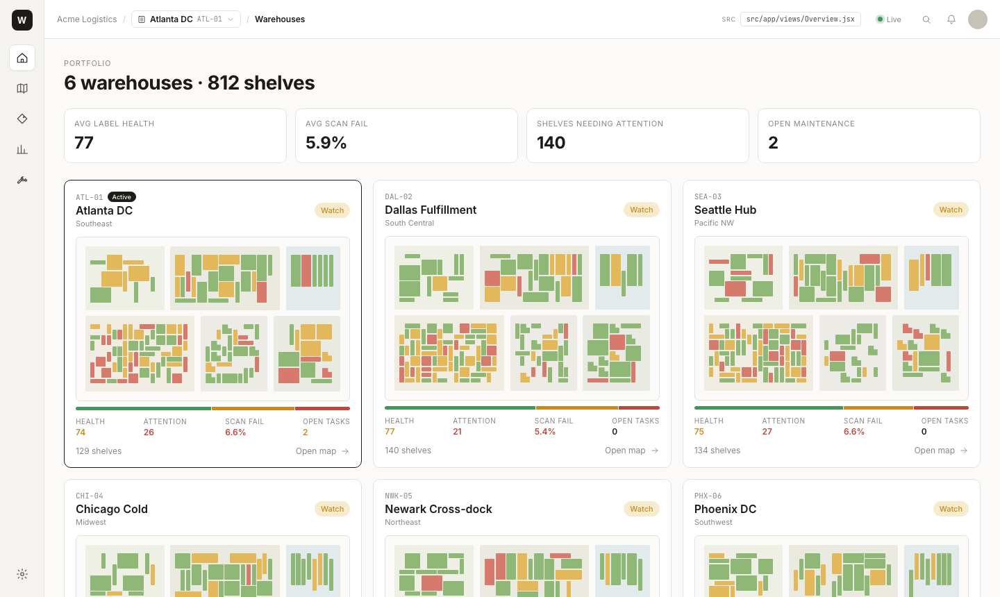
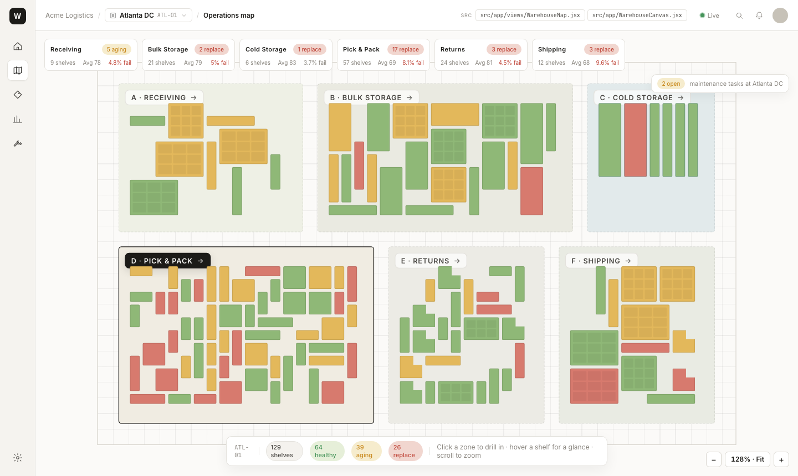
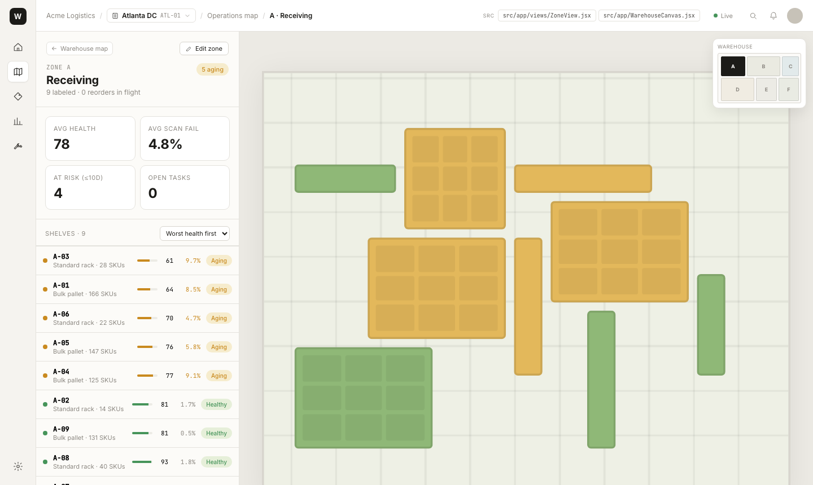
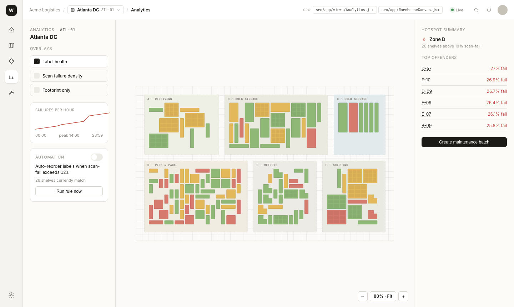
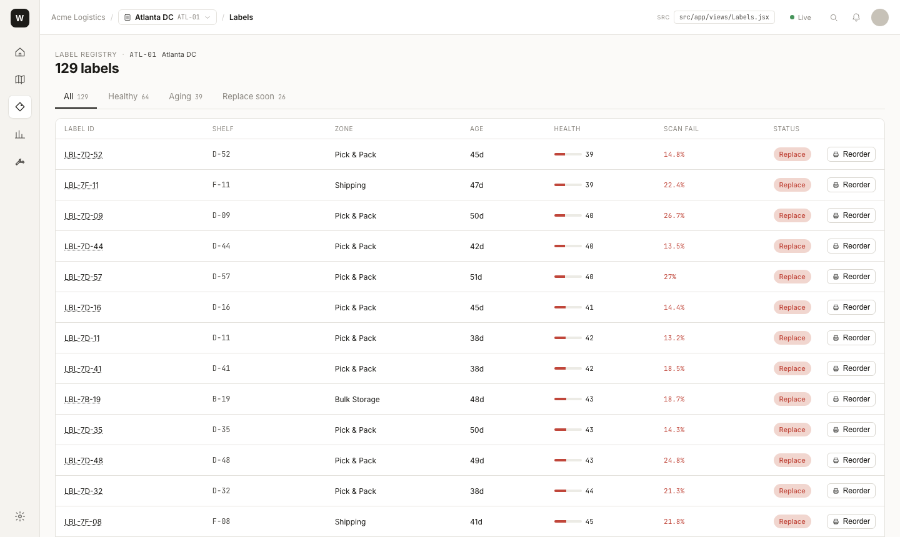
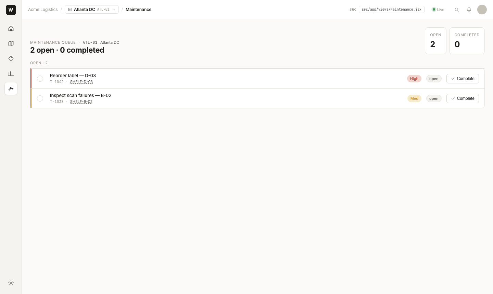

# Warehouse Digital Twin

A full-featured warehouse operations dashboard built as a single-page React app — no backend, no database. Every view shares live state through a single reducer so an action in one view (reorder a label, complete a task) propagates instantly across the whole app.

**Stack:** React 18 · Vite · custom pan/zoom SVG canvas · `localStorage` persistence

**[Live demo →](https://github.com/johnnyl72/warehouse-visualizer)**

---

## Screenshots

### Portfolio Overview
Six warehouses at a glance — live KPIs, traffic-light health, and a true scaled minimap of each floor.



---

### Operations Map
Full-floor monitor with per-zone health rail, pan/zoom canvas, hover tooltips, and click-through shelf drawers. Zones are color-coded by type (Receiving, Bulk Storage, Cold Storage, Pick & Pack, Returns, Shipping).



---

### Zone View + In-Place Editor
Clicking a zone opens it in an isolated canvas with a shelf list, KPI header, and warehouse minimap. **Edit zone** mode turns the canvas into a layout editor: draw, select, erase, move-label, multi-select with shift-click or marquee lasso — all changes write through to the live store immediately.



---

### Analytics
Switchable overlays (label health / scan-fail density / footprint), hourly failure sparkline, top-offender list, hotspot summary by zone, and a one-click auto-reorder rule.



---

### Label Registry
Full label registry with status tabs (All / Healthy / Aging / Replace soon), health bars, scan-fail rates, and one-click reorder that queues a print + maintenance task simultaneously.



---

### Maintenance Queue
Per-warehouse task queue. Completing a "Reorder label" task installs the new label and resets that shelf's health score live on the map.



---

## Features

| Feature | Details |
|---|---|
| **Multi-warehouse portfolio** | 6 sites with deterministic procedural layouts (same seed → identical floor every reload) |
| **Pan/zoom canvas** | One `WarehouseCanvas` component serves both read-only monitor and zone-edit modes |
| **Zone drill-down** | Click a zone → isolated canvas with minimap; jump to any other zone without going back |
| **In-place layout editor** | Draw / Select / Erase / Pan tools (`V B E H`); multi-select + bulk move/delete |
| **Predictive SLA** | Per-shelf "days until replacement" forecast from health score + scan-fail rate |
| **Cross-linked state** | Reorder in Labels → task in Maintenance → Complete resets shelf health on the map |
| **Offline-first** | No backend — state persists to `localStorage` under `wdt:v1` |
| **Shelf categories** | Standard, Bulk/pallet, Cold chain, Hazmat, Fast-pick, Returns, Staging — each with configurable dimensions and compliance rules |

---

## Architecture

```
src/
├── model.js              # Domain: warehouses, zones, shelf generation, predictive helpers
├── store.jsx             # Single reducer + React context — all state lives here
├── wf-primitives.jsx     # Shared visual atoms (Icon, Stat, Spark, seeded RNG)
├── app/
│   ├── App.jsx           # Shell: side nav, top bar, warehouse switcher, view router
│   ├── WarehouseCanvas.jsx  # Pan/zoom SVG canvas (read-only + zone-edit modes)
│   ├── ShelfDrawer.jsx   # Right-side shelf detail panel
│   ├── RackDrill.jsx     # Modal rack drill-down (levels × bays)
│   └── views/
│       ├── Overview.jsx      # Portfolio home
│       ├── WarehouseMap.jsx  # Operations map + zone rail
│       ├── ZoneView.jsx      # Isolated zone canvas + minimap + in-place edit
│       ├── Labels.jsx        # Label registry + reorder
│       ├── Analytics.jsx     # Overlays + hotspots + automation rule
│       └── Maintenance.jsx   # Per-warehouse task queue
```

**Key design choices:**
- **One reducer, no Redux/Zustand.** `store.jsx` is ~200 lines of action handlers. Every view reads the same snapshot.
- **Deterministic data generation.** `generateShelves(seed)` in `model.js` packs shelves zone-by-zone using a seeded RNG and per-zone "character" plans — organic gaps, mixed footprints, no uniform grid.
- **One canvas, two modes.** `WarehouseCanvas.jsx` handles both the read-only monitor and the zone-focus editor via props (`surface`, `focusZoneId`, `editInPlace`) so grid snap, marquee, and clamp logic stay in one place.
- **Wear prediction.** `predictDays(health, scanFail)` models label decay as a function of current health headroom and scan-fail pressure. Powers the "at risk ≤10d" KPI in every zone view.

---

## Run locally

```bash
npm install
npm run dev      # http://localhost:5173
npm run build    # production bundle → dist/
npm run preview
```

---

## Keyboard shortcuts

| Key | Scope | Action |
|---|---|---|
| `Esc` | Global | Clear selection · close drawer · exit zone |
| `V` / `B` / `E` / `H` | Zone-edit mode | Select / Draw / Erase / Pan |
| `Delete` / `Backspace` | Zone-edit mode | Delete selected shelf(s) |
| `Shift + click` | Zone-edit, Select tool | Add/remove from multi-selection |
| `Shift + drag` (background) | Zone-edit, Select tool | Extend lasso selection |
